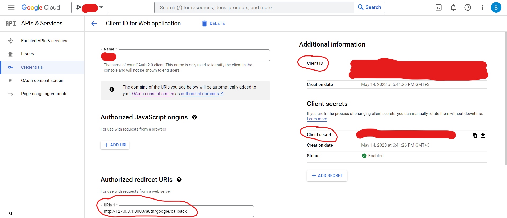
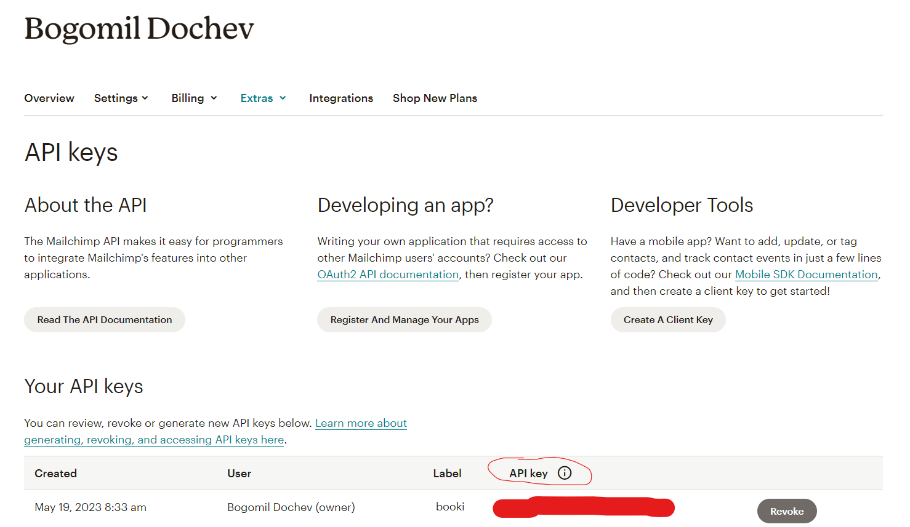
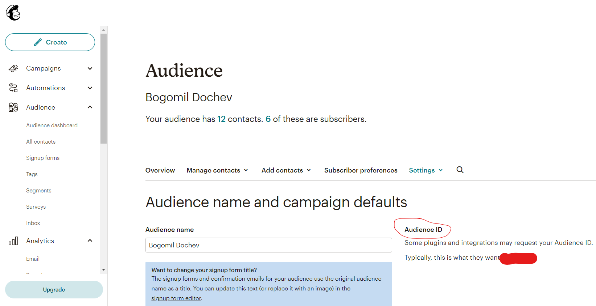
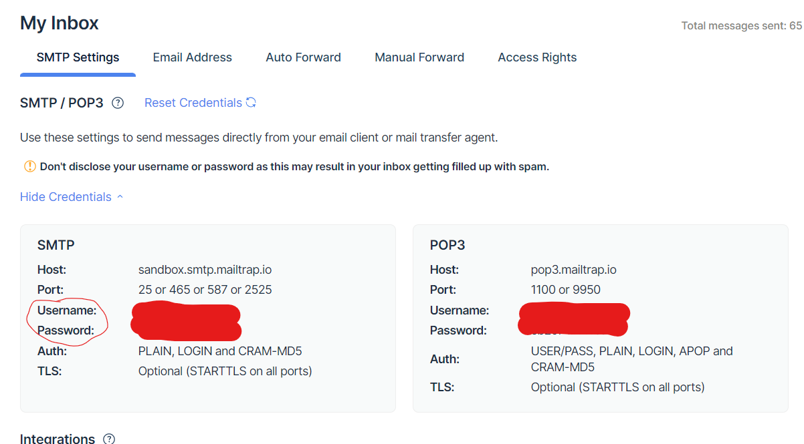

<p align="center"></p>

<a name="about"></a>
## About BookI

BookI is an online book store project with an admin panel where you can add or edit books. It is created using the Laravel PHP Framework.

<a name="Requirements"></a>
## Requirements
1. PHP v.8.1.10+
2. DB server (Recommended:MySQL)
3. Composer v.2.4.4+
4. Nodejs v.16.13.0+
5. NPM v.8.1.0+
6. Xdebug v3.2.0 (optional: if you want to check test coverage)

<a name="installation"></a>
## Installation

In order to run the project locally, you need to execute the following steps:
1. Clone the repository
    ```sh
    git clone https://github.com/BogomilDochev/BookI.git
    ```

2. Cd into the project root directory
    ```sh
    cd BookI
    ```

3. Install composer dependencies
    ```sh
    composer install
    ```

4. Install NPM dependencies
    ```sh
    npm install
    ```

5. Copy the .env file
    ```sh
    cp .env.example .env
    ```

6. Generate an app encryption key
    ```sh
    php artisan key:generate
    ```

7. Create an empty database for the application

8. In the .env file, add database information and change FILESYSTEM_DISK from 'local' to 'public'

9. Migrate and seed the database
    ```sh
    php artisan migrate --seed
    ```

10. Npm run build
    ```sh
    npm run build
    ```

11. Create a symbolic link
    ```sh
    php artisan storage:link
    ```

12. Run server
    ```sh
    php artisan serve
    ```

<a name="project"></a>
## In the project
In order to use the administrator privileges of the web application (add and edit books, categories, and coupons), you need to log in with the following email and password:<br>
Email: admin@admin.com<br>
Password: Admin1234!

If you register another account, you would have only the rights to add books to favorites or cart and writing comments under a book.

You can use Holiday Coupon in the cart section with code 'HOLIDAY-COUPON-2023' (only if your order is over two times of the discount (it needs to be over 40 dollars)).

If you want to try the following functionalities:
 - Login with Google
 - Subscribe for updates about the latest books from the main page
 - Receive email on every purchase

You need to configure these .env variables

1. Google Login
    ```sh
    GOOGLE_CLIENT_ID="YOUR-GOOGLE-CLIENT-ID-HERE"
    GOOGLE_CLIENT_SECRET="YOUR-GOOGLE-CLIENT-SECRET-HERE"
    GOOGLE_CLIENT_REDIRECT="YOUR-GOOGLE-CLIENT-REDIRECT-LINK-HERE"
    ```

These variables can be taken from your Google Developers Console account.
<p align="left"></p>


2. Subscribe for updates
    ```sh
    MAILCHIMP_KEY="YOUR-MAILCHIMP-KEY-HERE"
    MAILCHIMP_LIST_SUBSCRIBERS="MAILCHIMP-LIST-SUBSCRIBERS-ID-HERE"
    ```

These variables can be taken from your Mailchimp account.<br>
Profile>Extras>API keys
<p align="left"></p>
Audience>All Contacts>Settings>Audience name and defaults
<p align="left"></p>


3. Receive email on a purchase
    ```sh
   APP_URL="YOUR-APP-URL-HERE(http://127.0.0.1:8000/ if local environment)"

    MAIL_MAILER=smtp
    MAIL_HOST=sandbox.smtp.mailtrap.io
    MAIL_PORT=587
    MAIL_USERNAME="YOUR-MAILTRAP-USERNAME"
    MAIL_PASSWORD="YOUR-MAILTRAP-PASSWORD"
    MAIL_ENCRYPTION=tls
    ```

These variables can be taken from your Mailtrap account.<br>
Email Testing>Settings(gear icon beside your Mailtrap inbox)
<p align="left"></p>


You should also run <em>php artisan queue:work</em> command in order to receive the emails because they are sent with the use of queues. 

## Testing
It is possible to run all the automated tests by executing

    php artisan test
or

    vendor/bin/pest
In addition, you can check the code coverage of the tests (XDebug required) by running 

    XDEBUG_MODE=coverage php artisan test --coverage
For detailed HTML report about the tests, you need
    
    XDEBUG_MODE=coverage php artisan test --coverage-html=[name-of-folder]
